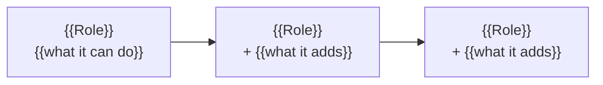

# {{User | Operator | API}} guide

<!-- Copy to <guides-dir>/<audience>-guide.md. One guide per AUDIENCE, roles as badges within it —
     never one guide per role. Organise by workflow, never by module. Guidance: reference.md §5. -->

{{One sentence: what this guide covers, organised by task, tagged by the role that can do it.}}

**Who this is for:** {{the audience, named plainly}}. {{Where another audience is served by another guide, point at it here.}}

**Reading the role badges:** each task carries a badge for the lowest role that can do it. `+` means "and every higher role". So **[{{Role}}+]** = {{Role}} and {{higher role}}.

| Badge | Roles |
| --- | --- |
| **[{{Role}}+]** | {{Role}}, {{higher}}, {{higher}} |
| **[{{Role}}+]** | {{Role}}, {{higher}} |
| **[{{Role}}]** | {{Role}} only |

<!-- Where the product name is configured per deployment, say so once, here, and then refer to it
     generically for the rest of the guide. -->

---

## Contents

<!-- Kept for reading on the web; a Word/PDF build drops this in favour of a generated TOC. -->

- [Getting started](#getting-started)
- [{{Workflow group}}](#{{anchor}}) **[{{Role}}+]**
- [{{Workflow group}}](#{{anchor}}) **[{{Role}}+]**

---

## Getting started

### What this {{app}} does

{{One paragraph, in the reader's language: what problem it solves, what they put in, what they get out. Name the real capabilities and limits — formats, sizes, counts — because those are what people plan around.}}

### Signing in

{{The real sign-in journey, step by step, with the exact button labels. Then what happens when access has not been granted: the exact screen they land on and who to ask.}}

> 📸 **Screenshot `sign-in`:** {{what to capture}}

### Your role and what it means

{{What the roles are, in increasing order, and that each can do everything the ones below it can.}}



| Role | What it adds |
| --- | --- |
| **{{Role}}** | {{the starting role — what everyone can do}} |
| **{{Role}}** | Everything a {{lower}} can do, **plus** {{…}} |

### Finding your way around

{{The navigation, grouped as the app groups it, with a table of where each item goes. Say which groups only some roles see.}}

> 📸 **Screenshot `navigation`:** {{what to capture}}

---

## {{Workflow group — e.g. Working with documents}}

**[{{Role}}+]**: {{who can do everything in this section}}.

### {{Task — a verb phrase, e.g. Upload a document}}

{{One sentence on what this achieves, if it is not obvious from the heading.}}

1. {{Step, with the exact control label in **bold**.}}
2. {{Step. Where a field has a choice worth explaining, explain it inline — sub-bullets, not a separate section.}}
3. {{Step.}}

{{What success looks like: the confirmation they see, and where the thing goes next.}}

> 📸 **Screenshot `{{key}}`:** {{what to capture}}

### {{The branch that surprises people — e.g. When a submission is held for review}}

<!-- The sections that earn a guide its keep. Each answers: why did this happen to me, what happens
     now, and what can I do about it. Give the real numbers, and say what they apply to — a
     per-item limit and a per-batch limit are confused every single time unless stated. -->

{{Why it happens, with the exact thresholds and what they are measured over.}}

{{What the reader sees when it happens — the real banner or badge text.}}

{{What happens next, and what they can do in the meantime.}}

### {{Track status / lifecycle}}

```mermaid
stateDiagram-v2
    [*] --> {{State}}: {{cause}}
    {{State}} --> {{State}}: {{cause}}
```

| Status | What it means |
| --- | --- |
| **{{Status}}** | {{in the reader's language — no internal names, no status codes}} |

---

## {{Workflow group — e.g. Administering your organisation}}

**[{{Role}}+]**: {{who}}. {{Where these screens live in the navigation.}}

### {{Task}}

{{Steps, as above. Where a capability exists but is not self-service, say how it is really reached — a support address, an operator, an API call — rather than inventing a screen for it.}}

> **{{The thing that trips people up}}.** {{The one-line explanation. E.g. "You can't approve your own submission: because roles are cumulative, a reviewer who also uploaded a job can't decide it themselves."}}

---

## {{Notifications & settings, or whatever closes the loop}}

**[{{Role}}+]**: everyone.

{{The cross-cutting things every reader needs: how they are told about events, what they can set for themselves, and which preferences follow them between devices versus which are per browser.}}
